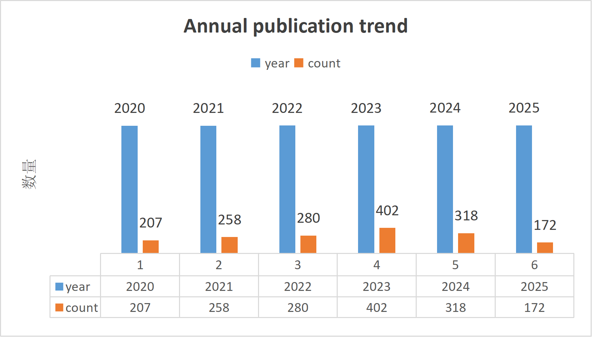
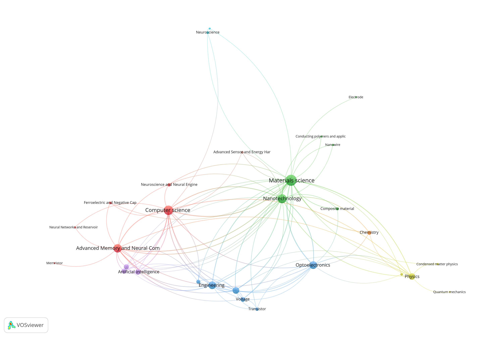
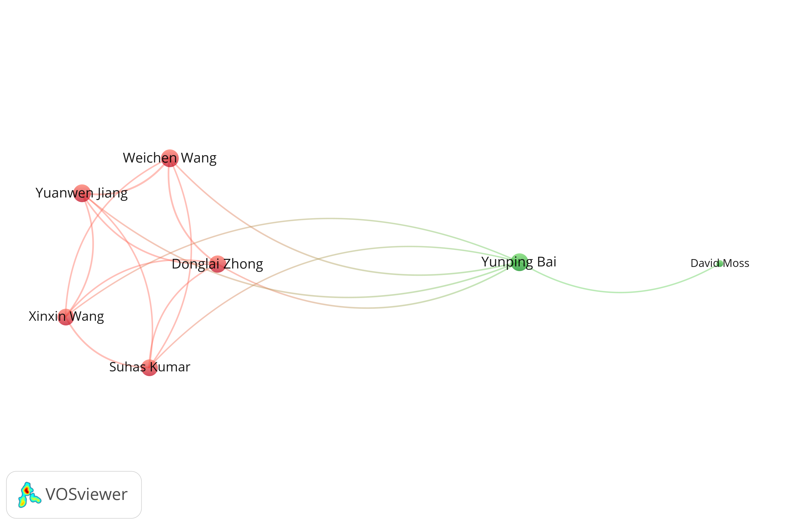
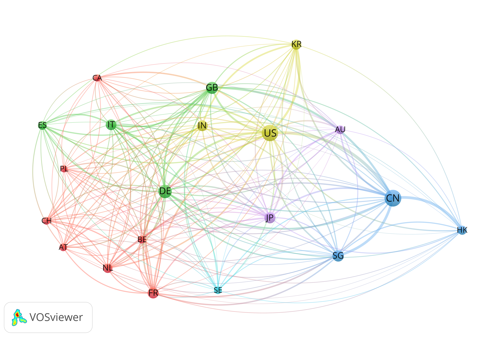
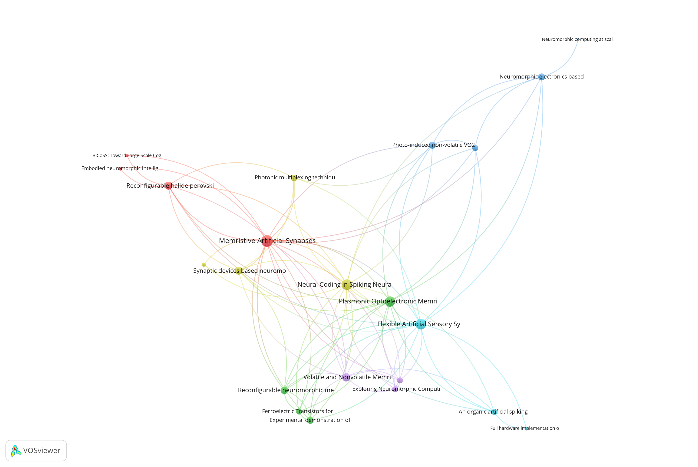
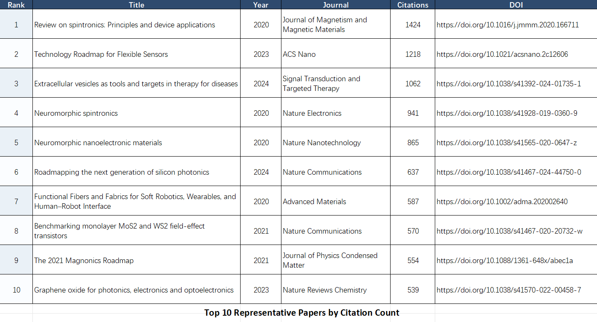

# 文献计量学项目

## 项目概述

本项目用于对"纳米线神经突触器件"领域进行文献计量分析，数据源为 OpenAlex。

## 成员分工

- 齐子豪（组长）统筹定稿：负责研究方案设计、整体进度统筹，整合全文内容，完成论文修改与最终定稿。
- 张林凯文献搜集：负责数据库文献检索、文献去重筛选，整理研究现状，撰写文献综述。
- 杨浩数据计量：负责数据清洗处理，使用计量软件完成可视化分析，制作研究图表、输出数据结果。
- 王子周童总结校对：负责分析结果解读，撰写研究结论与展望，完成论文排版、校对及资料整理归档。

## 图表展示

### 图1 年发文趋势图



### 图2 关键词共现聚类图



### 图3 合作网络图



### 图4 国家合作网络图



### 图5 共被引聚类图



### 表1 Top 10代表文献表



## 项目结构

```
wenxian-project/
├── config/                 # 配置文件目录
│   └── query.yaml          # 检索参数配置
├── data/
│   ├── raw/               # 原始数据（JSONL格式）
│   └── processed/         # 处理后的数据（CSV格式）
├── outputs/
│   ├── tables/            # 输出表格（边表、指标）
│   └── figures/           # 输出图表
├── reports/               # 报告文档
│   ├── method_note.md     # 方法说明
│   └── result_interpretation_template.md  # 结果解读模板
├── src/bmmini/            # 源代码模块
│   ├── __init__.py
│   ├── fetch_openalex.py  # OpenAlex数据获取
│   ├── normalize.py       # 数据规范化
│   ├── matrices.py        # 网络构建
│   ├── metrics.py         # 指标计算
│   ├── pipeline.py        # 完整流程
│   ├── main.py            # 分步流程
│   └── report_generator.py # 报告生成
├── tests/                 # 测试代码
└── requirements.txt       # 依赖列表
```

## 环境要求

- Python 3.11+
- conda 环境：`wen`

## 快速开始

### 1. 激活 conda 环境

```bash
conda activate wen
```

### 2. 安装依赖

```bash
pip install -r requirements.txt
```

### 3. 配置检索参数

编辑 `config/query.yaml`：

```yaml
query:
  search_terms: "(nanowire OR nanowires) AND (synaptic OR neuromorphic OR memristor)"
  from_year: 2020
  to_year: 2025
  max_records: 5000
```

### 4. 一键运行完整流程

```bash
# 使用示例数据（需提前准备 data/raw/sample_works.jsonl）
python src/bmmini/pipeline.py --config config/query.yaml --use-sample

# 或使用完整数据（需要从 OpenAlex 获取）
python src/bmmini/pipeline.py --config config/query.yaml
```

## 分步运行

```bash
# 步骤1: 从 OpenAlex 获取数据
python src/bmmini/main.py --steps fetch

# 步骤2: 数据规范化
python src/bmmini/main.py --steps normalize

# 步骤3: 构建网络边表
python src/bmmini/main.py --steps matrices

# 步骤4: 计算网络指标
python src/bmmini/main.py --steps metrics

# 运行多个步骤
python src/bmmini/main.py --steps normalize,matrices,metrics
```

## 生成结果报告

```bash
# 生成结果解读报告
python src/bmmini/report_generator.py --input outputs/tables --output reports/result_interpretation.md
```

## 运行测试

```bash
python -m pytest tests/test_matrices_metrics.py -v
```

## 输出文件说明

### 数据文件

| 文件路径 | 说明 |
|----------|------|
| `data/raw/openalex_works.jsonl` | 原始 OpenAlex 数据 |
| `data/processed/works_clean.csv` | 清洗后的文献信息 |
| `data/processed/work_references.csv` | 文献-参考文献关系 |
| `data/processed/work_authors.csv` | 文献-作者关系 |
| `data/processed/work_keywords.csv` | 文献-关键词关系 |

### 网络边表

| 文件路径 | 说明 |
|----------|------|
| `outputs/tables/co_citation_edges.csv` | 共引网络边表 |
| `outputs/tables/coupling_edges.csv` | 文献耦合边表 |
| `outputs/tables/keyword_cooccurrence_edges.csv` | 关键词共现边表 |
| `outputs/tables/coauthorship_edges.csv` | 合著网络边表 |

### 网络指标

| 文件路径 | 说明 |
|----------|------|
| `outputs/tables/*_node_metrics.csv` | 节点指标（degree, betweenness, pagerank, community） |
| `outputs/tables/*_graph_metrics.csv` | 图级指标（nodes, edges, density, components） |

### 图表

| 文件路径 | 说明 |
|----------|------|
| `outputs/figures/network_comparison.png` | 四类网络对比图 |
| `outputs/figures/*_analysis.png` | 各网络分析图 |

## 配置参数说明

`config/query.yaml` 主要参数：

| 参数 | 说明 | 默认值 |
|------|------|--------|
| `query.search_terms` | 检索式 | - |
| `query.from_year` | 起始年份 | 2020 |
| `query.to_year` | 结束年份 | 2025 |
| `query.max_records` | 最大记录数 | 5000 |
| `analysis.min_edge_weight` | 最小边权重 | 3 |
| `analysis.top_edges` | 保留 Top 边数 | 100 |

## 使用示例

### 示例1：使用示例数据运行

```bash
# 确保 data/raw/sample_works.jsonl 存在
python src/bmmini/pipeline.py --config config/query.yaml --use-sample
```

### 示例2：获取真实数据

```bash
# 设置 API Key（可选）
export OPENALEX_API_KEY=your_api_key

# 获取数据
python src/bmmini/main.py --steps fetch

# 完整分析
python src/bmmini/main.py --steps normalize,matrices,metrics
```

### 示例3：自定义分析参数

```bash
# 修改配置
sed -i 's/max_records: 5000/max_records: 1000/' config/query.yaml
sed -i 's/min_edge_weight: 3/min_edge_weight: 5/' config/query.yaml

# 运行分析
python src/bmmini/main.py --steps matrices,metrics
```

## 注意事项

1. **数据获取**：从 OpenAlex 获取大量数据可能需要较长时间
2. **内存使用**：处理大量数据时建议增加内存限制
3. **API Key**：OpenAlex 提供免费访问，但注册后可获得更高请求限额
4. **结果解读**：网络分析结果需结合领域知识进行解读

## 模块说明

| 模块 | 功能 |
|------|------|
| `fetch_openalex.py` | 从 OpenAlex API 获取文献数据 |
| `normalize.py` | 将 JSONL 转换为规范化 CSV 表 |
| `matrices.py` | 构建共引、耦合、共现、合著网络 |
| `metrics.py` | 计算节点和图级指标 |
| `pipeline.py` | 一键完成完整分析流程 |
| `report_generator.py` | 生成结果解读报告 |
